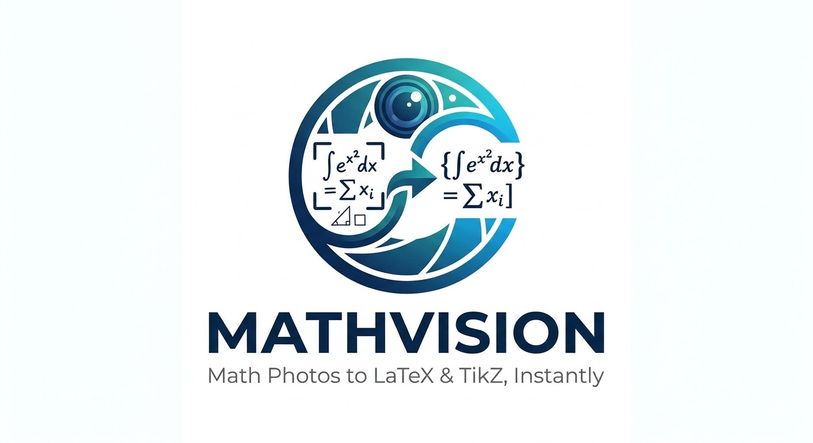

<div align="center">



# MathVision

### Turn photos of math into LaTeX & TikZ. Convert PDFs to editable DOCX. Instantly.

Upload a photo of formulas or geometric figures and get clean, copy-paste-ready LaTeX code.
Or drop a math PDF and download a fully formatted Word document — equations, tables, and all.

Powered by **Google Gemini** — runs 100% in your browser. Free and open-source.

[](https://ai.google.dev/)
[](https://react.dev/)
[](https://typescriptlang.org/)
[](LICENSE)
[](package.json)

**[Quick Start](#quick-start)** · **[Features](#features)** · **[FAQ](#faq)** · **[Troubleshooting](#troubleshooting)**

</div>

---

## Why MathVision?

Typing math is slow. Rewriting an entire PDF exam in Word is slower. MathVision does both in seconds:

- **Snap a photo** of a formula, problem set, or geometry figure — get LaTeX instantly
- **Drop a PDF** of a worksheet or exam — download a Word (.docx) file with equations, headings, and tables preserved
- **No cloud server** — your files and API key never leave your browser
- **No cost** — Gemini's free tier handles typical classroom workloads with no credit card required

Built by teachers, for teachers.

---

## Features

### Image to LaTeX

| You upload... | You get... |
|:---|:---|
| Photo of **math formulas** | Clean `$...$` **LaTeX** code |
| Photo of **geometric figures** | Compilable **TikZ** code with labeled points, angle arcs, and right-angle marks |
| Photo with **both** | Both LaTeX + TikZ in one output |
| **Handwritten** or printed | Works either way |

- Live **TikZ preview** in the browser — download diagrams as PNG
- Supports **Vietnamese** and **English** math notation
- One-click **copy** to paste into Overleaf, MathType, or any LaTeX editor

### PDF to DOCX

| You upload... | You get... |
|:---|:---|
| Math **PDF** (exam, worksheet, textbook page) | Downloadable **.docx** file |

- Page-by-page AI analysis preserves **headings, paragraphs, equations, tables, and images**
- Math rendered as native **OMML** (Office Math) — editable in Word, not just pictures
- Handles multi-page documents up to **50 MB**
- Preview each page's extracted content before downloading

---

## Quick Start

> No coding experience needed — 5 steps, under 3 minutes.

### 1. Install Node.js *(one time)*

Go to **https://nodejs.org** → download the **LTS** version → run the installer.

### 2. Get a free Gemini API key *(one time)*

Go to **https://aistudio.google.com/apikey** → sign in with Google → click **"Create API Key"** → copy it.

> Free tier. No credit card.

### 3. Download MathVision

**Option A — ZIP** *(easiest)*: Click the green **Code** button above → **Download ZIP** → extract anywhere.

**Option B — Git**:
```bash
git clone https://github.com/kagtgi/MathVision.git
cd MathVision
```

### 4. Start the app

| Platform | Command |
|:---|:---|
| **Windows** | Double-click **`start.bat`** |
| **Mac / Linux** | Open Terminal in the folder → `./start.sh` |

> First run installs dependencies automatically (~1 min). After that, startup is instant.

### 5. Use it

1. Open **http://localhost:3000** (the browser opens automatically)
2. Paste your **Gemini API key**
3. Choose a mode:
   - **Image → LaTeX**: drag-drop a photo → click **Convert to LaTeX** → copy the output
   - **PDF → DOCX**: drag-drop a PDF → click **Process** → preview → click **Download DOCX**

---

## LaTeX Output Quality

MathVision produces professional, standards-compliant LaTeX:

| Element | Output |
|:---|:---|
| Angle at B | `$\widehat{ABC}$` |
| Triangle | `$\triangle ABC$` |
| Congruent | `$\triangle ABC \cong \triangle DEF$` |
| Vector | `$\overrightarrow{AB}$` |
| Perpendicular | `$AB \perp CD$` |
| Degree | `$60{}^\circ$` |
| Derivative | `${f}'(x)$` |
| Vietnamese decimal | `$3{,}14$` |
| Brackets | Always `\left( \right)` — never bare |

TikZ output includes labeled points, right-angle marks, tick marks for equal segments, angle arcs, and compiles cleanly with pdfLaTeX.

---

## FAQ

**Is the Gemini API really free?**
Yes. Google's free tier is generous and covers typical classroom usage — no credit card required. See [pricing details](https://ai.google.dev/pricing).

**Is my data safe?**
Your API key lives only in your browser's session memory. Your images and PDFs are sent directly to Google's Gemini API and nowhere else. Nothing is stored on disk or on any third-party server.

**Can I use this offline?**
You need an internet connection for the Gemini API calls and the TikZJax CDN. Everything else runs locally.

**How do I stop the app?**
Press `Ctrl+C` in the terminal, or close the command window on Windows.

**How do I update?**
`git pull` if you cloned, or re-download the ZIP from GitHub.

---

## Troubleshooting

| Problem | Solution |
|:---|:---|
| `'node' is not recognized` | Install Node.js from https://nodejs.org |
| API key error | Double-check your key at https://aistudio.google.com/apikey |
| TikZ diagram not rendering | Check your internet connection (TikZJax loads from a CDN) |
| Port 3000 already in use | Edit `package.json`: change `--port=3000` to `--port=3001` |
| Blank or garbled output | Try a clearer, well-lit photo or a higher-resolution PDF |
| DOCX equations look wrong | Open the file in Microsoft Word or LibreOffice — Google Docs doesn't support OMML |

---

## Tech Stack

| Layer | Technology |
|:---|:---|
| UI | React 19, TypeScript, Vite |
| Styling | Tailwind CSS 4, Framer Motion |
| AI | Google Gemini |
| Math rendering | KaTeX (browser), OMML (DOCX export) |
| TikZ rendering | TikZJax |
| PDF parsing | PDF.js |
| DOCX generation | docx.js |

---

## License

MIT — free to use, modify, and distribute.

---

<div align="center">

Made for mathematics teachers everywhere

</div>
