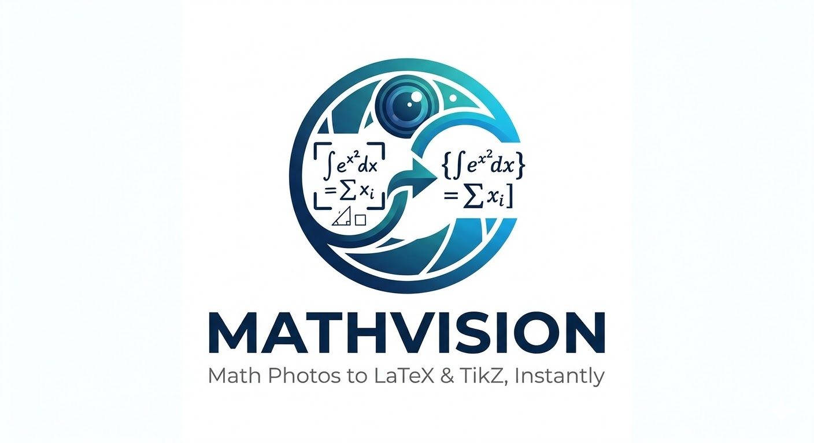

<div align="center">



# MathVision

### Ảnh hoặc PDF đề thi toán → file Word đúng chuẩn, có sẵn đáp án chi tiết

Thả một file PDF (hoặc ảnh chụp) đề thi vào, nhận về `.docx` đã chuẩn hoá bố cục,
tự giải toàn bộ đề và dựng mục **ĐÁP ÁN CHI TIẾT** theo văn phong sách giáo khoa THPT.

Chạy hoàn toàn trên máy bằng **Google Gemini** — chỉ cần nhập API key một lần.

</div>

---

## Dùng ngay (không cần cài gì)

1. Tải `MathVision-1.0.0.exe` (bản portable, chạy trực tiếp).
2. Lấy API key miễn phí tại **https://aistudio.google.com/apikey**.
3. Mở app, dán key, bấm **Kiểm tra và bắt đầu**. Key lưu trên máy, lần sau không phải nhập lại.

> Windows SmartScreen có thể cảnh báo vì file chưa ký số: bấm **More info** → **Run anyway**.

## Làm được gì

| Chế độ | Đầu vào | Đầu ra |
|:---|:---|:---|
| **PDF → Word** | PDF đề thi, tối đa 50 MB | `.docx` chuẩn + đáp án chi tiết |
| **Ảnh → Word** | Ảnh chụp/quét trang đề (PNG, JPG, WebP) | như trên |

Các bước app tự làm:

- **Đọc đề** từng trang, giữ nguyên công thức, bảng số liệu, phương án A–D.
- **Cắt hình** trong đề ra khỏi trang PDF. Hình luôn có — nếu vẽ lại bằng TikZ không thành
  công thì vẫn dùng ảnh cắt, không bao giờ để chỗ trống.
- **Tự giải cả đề**: trắc nghiệm, đúng/sai, trả lời ngắn, tự luận. Giải hai lượt độc lập
  rồi đối chiếu; lệch nhau thì có lượt thứ ba phân xử và câu đó được đánh dấu để bạn soi lại.
- **Tự vẽ hình** cho bài hình học không gian lớp 11 khi đề chưa có hình.
- **Dựng bố cục chuẩn**: bỏ phiếu tô trắc nghiệm, chuẩn hoá tiêu đề PHẦN, lặp lại từng câu
  trong mục ĐÁP ÁN CHI TIẾT với đáp án đúng gạch chân, dòng "Lời giải", "Chọn X." tô xanh.
- **Đối chiếu với lớp văn bản có sẵn trong PDF** để bắt câu bị bỏ sót, số bị đọc sai hay
  nội dung máy tự thêm. Chỉ báo cho bạn xem, không tự sửa.

### Hai định dạng đầu ra

Chọn ở thanh công cụ phía trên bản xem trước:

| Định dạng | Dùng khi | Đặc điểm |
|:---|:---|:---|
| **Định dạng thường** | đề tặng kèm K11 | Times New Roman 12pt, có nhãn "Câu N.", đáp án đúng gạch chân, dòng "Chọn X." tô xanh lá, footer số trang |
| **Định dạng VDC** | nộp cho nhóm VDC Bhp | Palatino Linotype 11.5pt, bỏ nhãn "Câu N.", bốn phương án một dòng, đáp án đúng **đỏ + bôi vàng + gạch chân**, ý đúng/sai thành dòng riêng IN HOA, câu trả lời ngắn dùng ô đáp án bôi vàng, có header của nhóm |

Ở định dạng VDC có thêm nút **Tải .txt** — bản văn bản thuần theo quy ước nhập liệu của
nhóm (mỗi phương án một dòng, công thức dùng `\left`/`\right`, `{A}'`, `\int\limits`).

Trước khi tải về, bạn xem trước được toàn bộ tài liệu, **sửa trực tiếp** nội dung, và xem
danh sách cảnh báo kiểm tra chất lượng.

File tải về nằm trong thư mục **Downloads**, và app tự mở Explorer chỉ đúng file vừa tải.

## Sau khi tải file Word

Công thức trong file giữ ở dạng chữ `$...$`. Muốn thành equation MathType thật thì chạy
Toggle TeX — script tự động nằm trong thư mục `mathtype/` cạnh file exe, xem
[`mathtype/README.md`](mathtype/README.md).

Lý do không xuất equation sẵn: MathType cho chất lượng in và khả năng sửa tốt hơn hẳn
equation do thư viện sinh ra, và đây là cách file mẫu chuẩn đang dùng.

## Điều nên biết

- **Máy giải vẫn có thể sai.** App không bao giờ chọn phương án "gần đúng": nếu giá trị tính
  được không khớp phương án nào, nó ghi `Chọn ?` và nêu rõ giá trị đúng trong lời giải — đề
  in sai là chuyện có thật. Câu nào hai lượt giải lệch nhau đều được cảnh báo.
- **Tốn hạn mức API.** Đề 40 câu bật "giải 2 lượt" tốn khoảng 80–100 lượt gọi. Tắt bớt tuỳ
  chọn nếu cần chạy nhanh hoặc đang hết hạn mức.
- **Chạy offline được mọi thứ trừ phần gọi Gemini** — font, bộ hiển thị công thức, bộ vẽ
  TikZ đều nằm trong file exe.

## Dành cho người phát triển

```bash
npm install
npm run dev          # http://localhost:3000
npm run verify       # 5 bộ kiểm chứng, phải PASS hết trước khi commit
npm run electron:build   # -> release/MathVision-<version>.exe
```

Cấu trúc: `src/pipeline/` là toàn bộ phần xử lý (thuần hàm, chạy được dưới Node nên test
được), `src/components/` là UI dùng chung, hai file `*Converter.tsx` là hai chế độ.
`mmdBlocks.ts` quét MMD thành khối ngữ nghĩa; `mmdToDocx.ts` và `mmdToDocxVdc.ts` chỉ khác
nhau ở phần trình bày.

Chạy thật một đề để đo chất lượng (cần API key thật):

```bash
GEMINI_API_KEY=... node scripts/run-real-exam.mjs de.pdf --compare golden.mmd
```

Font Google Sans trong `public/fonts/` đã cắt còn Latin + dấu tiếng Việt (4,5 MB → 110 KB).
Dựng lại bằng `node scripts/build-fonts.mjs <thư-mục-Google_Sans>`.

`npm run verify` gồm:

| Harness | Kiểm gì |
|:---|:---|
| `verify-pipeline.mjs` | 25 đề đã hoàn chỉnh chạy lại phải ra chính nó (bất biến), cộng fixture cho từng rule |
| `verify-docx.mjs` | `document.xml` sinh ra phải trùng khớp với bộ sinh docx gốc đã kiểm chứng |
| `verify-solver-shape.mjs` | Khối lời giải do máy sinh phải chạy lọt qua bước tái cấu trúc, kể cả đề không chia PHẦN |
| `verify-vdc.mjs` | docx và .txt định dạng VDC khớp file mẫu của nhóm, và định dạng thường không bị ảnh hưởng |
| `verify-textlayer.mjs` | Lớp đối chiếu văn bản PDF bắt được lỗi thật mà không báo oan |

Sửa gì trong `src/pipeline/` cũng phải chạy lại cả năm — đó là bằng chứng duy nhất cho việc
định dạng đầu ra không bị lệch khỏi file mẫu.

## Công nghệ

React 19 · TypeScript · Vite · Electron · Google Gemini · pdf.js · docx.js ·
[mathpix-markdown-it](https://github.com/Mathpix/mathpix-markdown-it) (MIT, dùng cho khung
xem trước) · TikZJax

## Giấy phép

MIT
