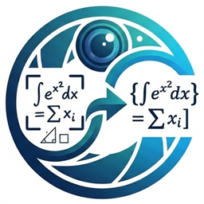

<div align="center">



# MathVision

### Đề thi toán PDF hoặc ảnh → file Word đúng chuẩn, có sẵn đáp án chi tiết

Thả một file PDF (hoặc ảnh chụp) đề thi vào, nhận về `.docx` đã chuẩn hoá bố cục,
tự giải toàn bộ đề và dựng mục **ĐÁP ÁN CHI TIẾT** theo văn phong sách giáo khoa THPT.

Chạy hoàn toàn trên máy bằng **Google Gemini** — chỉ cần nhập API key một lần.

<br />

[](https://github.com/kagtgi/MathVision/releases/latest)

*Windows 64-bit · chọn `MathVision-Setup-x.y.z.exe` để cài (tự cập nhật được),
hoặc `MathVision-x.y.z.exe` bản portable không cần cài*

</div>

---

## Bắt đầu trong 3 bước

1. **Tải file** bằng nút phía trên rồi mở lên. Bản `Setup` cài vào máy và **tự thông báo khi
   có bản mới** ("Khởi động lại để cập nhật"); bản portable chỉ báo có bản mới, phải tải
   tay. Windows báo *"Windows protected your PC"* thì
   bấm **More info** → **Run anyway** — file chưa mua chứng chỉ ký số nên Windows cảnh báo,
   không phải dấu hiệu file có hại. Muốn tự kiểm chứng thì xem [mã SHA256 trong Release](https://github.com/kagtgi/MathVision/releases/latest).
2. **Lấy API key miễn phí** tại **https://aistudio.google.com/apikey** — đăng nhập Google,
   bấm *Create API Key*, copy lại.
3. **Dán key vào app.** Chỉ nhập một lần, lần sau mở là dùng luôn.

> Mỗi người nên dùng key riêng của mình. Dùng chung sẽ chia nhau hạn mức và ai cũng bị chậm.

## Làm được gì

| Chế độ | Đầu vào | Đầu ra |
|:---|:---|:---|
| **PDF → Word** | PDF đề thi, tối đa 50 MB | `.docx` chuẩn + đáp án chi tiết |
| **Ảnh → Word** | Ảnh chụp/quét trang đề (PNG, JPG, WebP) | như trên |

Các bước app tự làm:

- **Đọc đề** từng trang, giữ nguyên công thức, bảng số liệu, phương án A–D.
- **Vẽ lại hình bằng TikZ cho nét.** Hình học, đồ thị, biểu đồ được dựng lại thay vì dùng
  ảnh cắt lem nhem từ PDF; ảnh chụp vật thật thì giữ nguyên ảnh gốc. TikZ hỏng thì rơi về
  ảnh cắt, không bao giờ để chỗ trống.
- **Tự giải cả đề**: trắc nghiệm, đúng/sai, trả lời ngắn, tự luận. Giải hai lượt độc lập
  rồi đối chiếu; lệch nhau thì có lượt thứ ba phân xử và câu đó được đánh dấu để bạn soi lại.
- **Tự vẽ hình** cho bài hình học không gian lớp 11 khi đề chưa có hình.
- **Dựng bố cục chuẩn**: bỏ phiếu tô trắc nghiệm, chuẩn hoá tiêu đề PHẦN, lặp lại từng câu
  trong mục ĐÁP ÁN CHI TIẾT với đáp án đúng gạch chân, dòng "Lời giải", "Chọn X." tô màu.
- **Đối chiếu với lớp văn bản có sẵn trong PDF** để bắt câu bị bỏ sót, số bị đọc sai hay
  nội dung máy tự thêm. Chỉ báo cho bạn xem, không tự sửa.

### Hai định dạng đầu ra

Chọn ở thanh công cụ phía trên bản xem trước:

| Định dạng | Dùng khi | Đặc điểm |
|:---|:---|:---|
| **Định dạng thường** | đề tặng kèm K11 | Times New Roman 12pt, có nhãn "Câu N.", đáp án đúng gạch chân, dòng "Chọn X." tô xanh lá, footer số trang |
| **Định dạng VDC** | nộp cho nhóm VDC Bhp | Palatino Linotype 11.5pt, bỏ nhãn "Câu N.", bốn phương án một dòng, đáp án đúng **đỏ + bôi vàng + gạch chân**, ý đúng/sai thành dòng riêng IN HOA, câu trả lời ngắn dùng ô đáp án bôi vàng, có header của nhóm |

Ở định dạng VDC có thêm nút **Tải .txt** — bản văn bản thuần theo quy ước nhập liệu của
nhóm (mỗi phương án một dòng, công thức dùng `\left`/`\right`, `{A}'`, `\int\limits`).

### Xem trước và sửa trước khi tải

Tab **Xem trước** dựng đúng file Word sắp tải — đúng khổ giấy, lề, màu chữ và cách trình
bày phương án; công thức được hiển thị sẵn thay cho chữ `$...$` để soát bài cho nhanh.
Tab **MMD** cho sửa trực tiếp nội dung, tab **Kiểm tra** liệt kê cảnh báo chất lượng và
bấm vào là nhảy tới đúng dòng.

Bấm **Tải Word** sẽ hiện hộp thoại chọn thư mục lưu (lần sau mặc định vào thư mục vừa
chọn), lưu xong app tự mở Explorer chỉ đúng file đó.

## Sau khi tải file Word

Công thức trong file giữ ở dạng chữ `$...$`. Muốn thành equation MathType thật thì chạy
Toggle TeX — script tự động nằm trong thư mục [`mathtype/`](mathtype/), xem
[`mathtype/README.md`](mathtype/README.md).

Lý do không xuất equation sẵn: MathType cho chất lượng in và khả năng sửa tốt hơn hẳn
equation do thư viện sinh ra, và đây là cách file mẫu chuẩn đang dùng.

## Điều nên biết

- **Máy giải vẫn có thể sai.** App không bao giờ chọn phương án "gần đúng": nếu giá trị tính
  được không khớp phương án nào, nó ghi `Chọn ?` và nêu rõ giá trị đúng trong lời giải — đề
  in sai là chuyện có thật. Câu nào hai lượt giải lệch nhau đều được cảnh báo.
- **Tốn hạn mức API.** Đề 40 câu bật "giải 2 lượt" tốn khoảng 80–100 lượt gọi. Tắt bớt tuỳ
  chọn nếu cần chạy nhanh hoặc đang hết hạn mức.
- **Chạy offline được mọi thứ trừ phần gọi Gemini** — font, bộ hiển thị công thức, bộ vẽ
  TikZ đều nằm trong file exe.

## Dành cho người phát triển

```bash
npm install
npm run dev              # http://localhost:3000
npm run verify           # 12 bộ kiểm chứng, phải PASS hết trước khi commit
npm run verify:ci        # chỉ 6 bộ tự chứa fixture — cũng là bộ CI chạy trên mỗi PR
npm run electron:build   # -> release/MathVision-Setup-<version>.exe + bản portable
```

Muốn góp code thì đọc [CONTRIBUTING.md](CONTRIBUTING.md) — có nói rõ ba harness cần dữ liệu
đề thi thật nằm ngoài repo.

Cấu trúc: `src/pipeline/` là toàn bộ phần xử lý (thuần hàm, chạy được dưới Node nên test
được), `src/components/` là UI dùng chung, hai file `*Converter.tsx` là hai chế độ.
`mmdBlocks.ts` quét MMD thành khối ngữ nghĩa; `mmdToDocx.ts` và `mmdToDocxVdc.ts` chỉ khác
nhau ở phần trình bày.

Chạy thật một đề để đo chất lượng (cần API key thật):

```bash
GEMINI_API_KEY=... node scripts/run-real-exam.mjs de.pdf --compare golden.mmd
```

Font Google Sans trong `public/fonts/` đã cắt còn Latin + dấu tiếng Việt (4,5 MB → 110 KB).
Dựng lại bằng `node scripts/build-fonts.mjs <thư-mục-Google_Sans>`.

`npm run verify` gồm:

| Harness | Kiểm gì |
|:---|:---|
| `verify-pipeline.mjs` | 25 đề đã hoàn chỉnh chạy lại phải ra chính nó (bất biến), cộng fixture cho từng rule |
| `verify-docx.mjs` | `document.xml` sinh ra phải trùng khớp với bộ sinh docx gốc đã kiểm chứng |
| `verify-numbering.mjs` | Nhãn "Câu N." dựng bằng numbering của Word, đúng spec đo từ file mẫu |
| `verify-solver-shape.mjs` | Khối lời giải do máy sinh phải chạy lọt qua bước tái cấu trúc, kể cả đề không chia PHẦN |
| `verify-vdc.mjs` | docx và .txt định dạng VDC khớp file mẫu của nhóm, và định dạng thường không bị ảnh hưởng |
| `verify-textlayer.mjs` | Lớp đối chiếu văn bản PDF bắt được lỗi thật mà không báo oan |
| `verify-download.mjs` | Bấm Tải trong bản đóng gói thì file thật sự được ghi ra đĩa |
| `verify-update.mjs` | Bản đóng gói có đủ `electron-updater` trong asar, `app-update.yml` và `latest.yml` |
| `verify-tikz-sanitize.mjs` | Bộ lọc mã TikZ chặn đúng bốn thứ đã đo là làm chết hình |
| `verify-history.mjs` | Lưu → mở lại → xuất Word ra `document.xml` trùng **từng ký tự** |
| `verify-secrets.mjs` | `secrets.json` của bản đóng gói **không chứa** key đọc được |
| `verify-history-app.mjs` | Kho lịch sử trên đĩa: sửa chữ không mất hình, chặn id dạng đường dẫn |

Sửa gì trong `src/pipeline/` hay `electron/` cũng phải chạy lại cả mười hai — đó là bằng chứng duy nhất cho
việc định dạng đầu ra không bị lệch khỏi file mẫu.

Đo năng lực bộ dựng hình TikZ (chỉ lúc phát triển): `npm run dev` rồi mở `/probe-tikz.html`.
Kết quả đo được chốt trong [`src/utils/tikzCapabilities.ts`](src/utils/tikzCapabilities.ts), và
prompt vẽ hình **sinh từ file đó** nên không thể lệch khỏi thực tế renderer.

## Công nghệ

React 19 · TypeScript · Vite · Electron · Google Gemini · pdf.js · docx.js ·
[docx-preview](https://github.com/VolodymyrBaydalka/docxjs) (Apache-2.0, khung xem trước) ·
[mathpix-markdown-it](https://github.com/Mathpix/mathpix-markdown-it) (MIT, dựng công thức) ·
TikZJax

## Giấy phép

MIT
